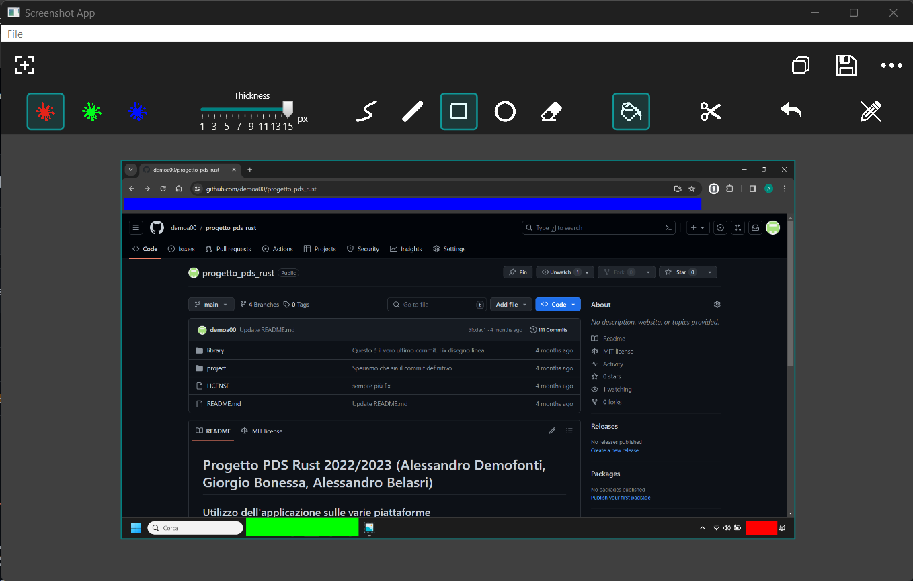
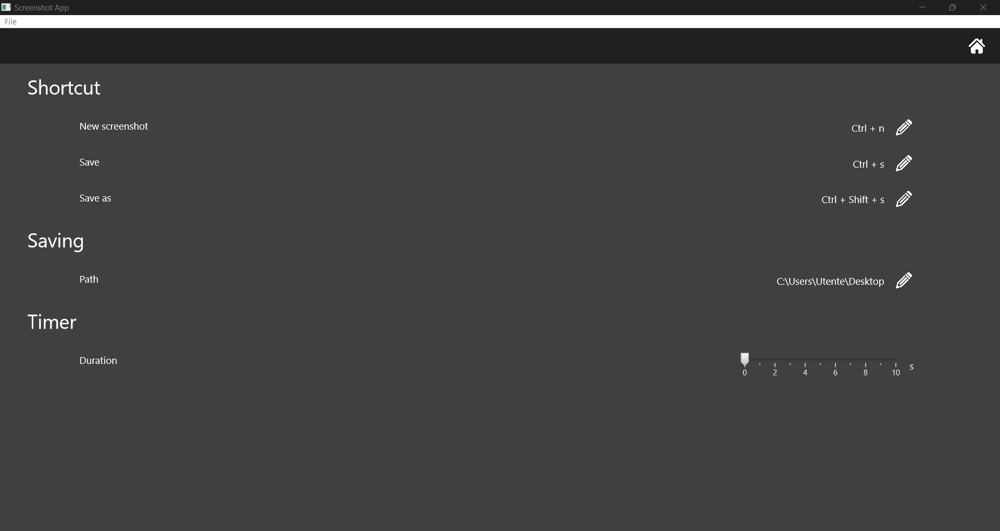

# Progetto PDS Rust 2022/2023 (Alessandro Demofonti, Giorgio Bonessa, Alessandro Belasri)

## Utilizzo dell'applicazione sulle varie piattaforme

L'applicazione allo stato attuale funziona per sistemi Windows e MacOS (ancora da testare) senza alcuna installazione aggiuntiva

Per quanto riguarda invece piattaforme Linux risulta necessario che vengano installate precedentemente al lancio dell'applicazione dei pacchetti richiesti dalla libreria utilizzata per l'interfaccia grafica (druid).

Le dipendenze aggiuntive possono essere trovate al fondo della pagina web dedicata al crate utilizzato, al seguente link:

<https://crates.io/crates/druid>

## App UI

